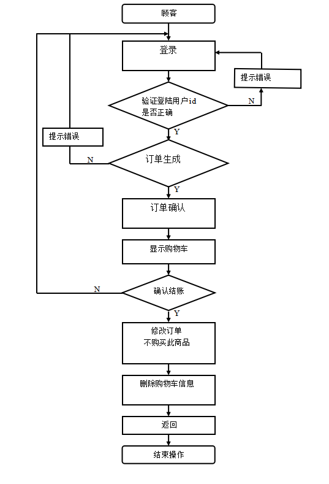

# Web需求分析

## 一、用例图

## 二、项目类图

## 三、上下文关系图

## 四、系统体系结构

   本网上订餐系统采用了B/S架构的设计体系，B/S结构相对于传统的C/S
结构，这种结构使得数据只有结果集合在浏览器中显示，数据的处理在服务
器进行，用户不用安装客户端，而且由于通过服务器端统一管理数据，很大
程度简化了开发WEB应用的难度；易于保证数据的一致性。

## 五、登录模块流程图

## 六、顾客订购流程图

#### 说明：
   顾客模块的主要功能是浏览，。浏览与自己相关的零食信息，订单信
息等。用户要下订单之前美食车要把详细食物信息列出，物品的单价，购买
的数量，总共的价钱，可修改和删除购买，当符合顾客要求的时候，顾客就
可以下订单。下订单时首先会让用户确定一下订单是否付合要求，确认无误
后，进入填写接收信息后生成订单。然后对数据库进行操作完成。

## 七、项目活动图

## 八、展示模型建筑

   向导在最顶部出现，菜单在向导下面出现，查询在右上角出现，商品在中
间出现，一共有联两行，共有6条数据，默认显示首页，采用分页的方式展现商
品，热门商品出现在最左边。
     
     **UI元素：** 文本构造为<text>,图片构造为<image>,按钮构造为<button>
